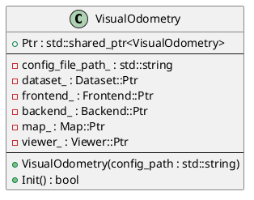
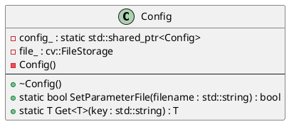
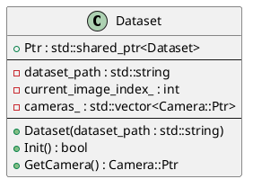
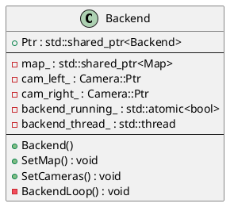
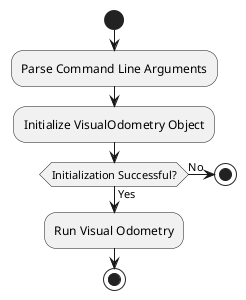

# 笔记

## 类介绍

### VisualOdometry

该类用于整个项目的核心组织构建，包括：todo

- 配置文件的读取
- 其他组件的创建

#### 类图

TODO：更新类图

#### 类介绍

成员变量
- `Ptr`: 类型别名，用于创建智能指针类型的类
- `config_file_path_`: 存储配置文件路径
- `dataset_`: 关联`Dataset`类，用于访问和管理 `Dataset` 类的实例
- `frontend_`: 关联`Frontend`类，用于访问和管理 `Frontend` 类的实例
- `backend_`: 关联`Backend`类，用于访问和管理 `Backend` 类的实例
- `map_`: 关联`Map`类，用于访问和管理 `Map` 类的实例
- `viewer_`: 关联`Viewer`类，用于访问和管理 `Viewer` 类的实例

成员函数
- `VisualOdometry()`: 配置`config_file_path_`
- `Init()`: 读取配置文件并创建其他关联的类

### Config

该类用于读取配置文件、返回配置参数

#### 类图

#### 类介绍

成员变量

- `config_`: `std::shared_ptr<Config>` 类型的静态成员变量负责确保 `Config` 类在程序中仅有一个实例（单例模式）。它在调用 `SetParameterFile` 时进行初始化，之后用于全局访问配置文件内容， 便于获取参数配置。
- `file_`: 用于读写配置文件

成员函数

- `Config()`: 构造函数，为private，保证了单例模式，无法通过其他方式实例化
- `~Config();`: 析构函数，为public，释放文件资源
- `SetParameterFile()`: 为 `static` 类型，与单例模式配合，用于加载指定的配置文件
- `Get()`: 采用模板函数的方式，用于获取对应的配置参数

### Dataset

用于对数据集的读取，构造时传入配置文件路径

#### 类图

#### 类介绍

成员变量

- `Ptr`: 类型别名，用于创建共享指针类型的类
- `dataset_path`: 存储数据集的文件路径
- `current_image_index_`: 存储当前图像的索引
- `cameras_`: 存储相机的向量，（含有多个相机）

成员函数

- `Dataset()`: 构造函数初始化数据集文件路径
- `Init()`: 读取多个相机的内参外参，并将相机存储到相机向量中
- `GetCamera()`: 根据相机的id获取相机类

### Backend

该类用于处理视觉里程计的后端

#### 类图

#### 类介绍

成员变量

- `Ptr`: 类型别名，用于创建共享指针类型的类
- `map_`: 地图类
- `cam_left_`: 左目相机
- `cam_right_`: 右目相机
- `backend_running_`: 表示是否开启后端标志位
- `backend_thread_`: 后端线程变量，用于执行 `BackendLoop` 函数

成员函数

- `Backend()`: 构造函数，用于创建线程标志并创建后端线程
- `SetMap()`: 配置地图
- `SetCameras()`: 配置相机
- `BackendLoop()`: 后端函数

### Map

todo

#### 类图

#### 类介绍

成员变量

成员函数

### Viewer

todo

#### 类图

#### 类介绍

成员变量

成员函数

### classname

#### 类图

#### 类介绍

成员变量

成员函数

## 函数流程

在主函数中，首先实例化的类是 `VisualOdometry` (视觉里程计)

该类用于整个项目的核心组织构建，包括：

- 配置文件的读取
- 其他组件的创建

在主函数中创建 `VisualOdometry` 类型的对象 `vo`，然后执行成员函数 `Init()` 来读取配置文件并创建其他关联的类。

在 `Init()` 函数根据 `Config` 类中的文件路径，通过 `SetParameterFile()` 函数加载指定的配置文件

然后通过 `Get()` 函数返回特定的类型

